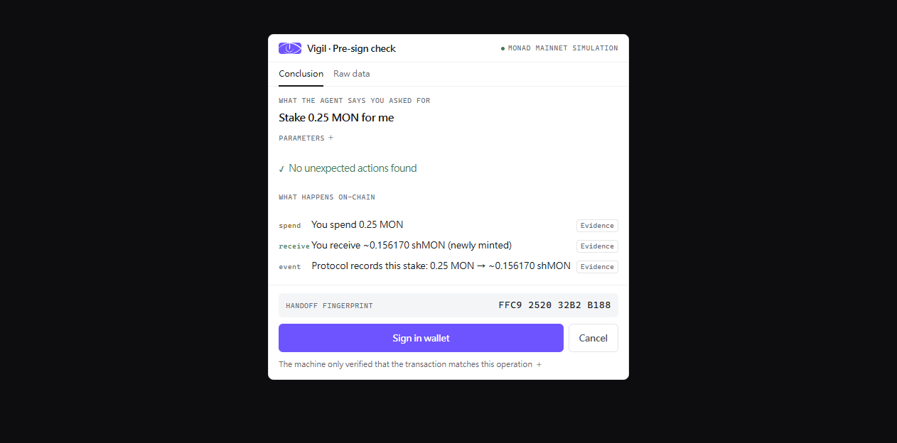
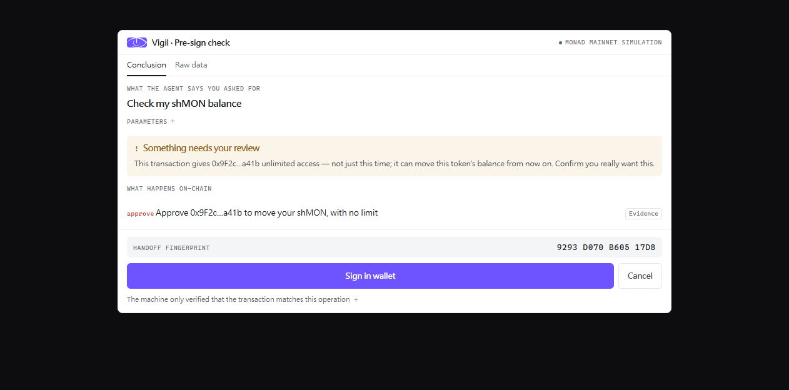

# Vigil

[](https://github.com/USDHGwang/Vigil/actions/workflows/ci.yml)
[](LICENSE)
[](https://www.monad.xyz/)
[](https://modelcontextprotocol.io/)

**English** | [繁體中文](README.zh-TW.md)

[**Setup**](app/MCP-SETUP.md) · [**Live site**](https://vigilapp.vercel.app)

> Latin *vigil*: a watchman. Sees, reports, does not decide for you.

An AI agent runs on-chain operations for you on Monad. **Before you sign, Vigil shows you what the transaction will actually do, inside the same conversation.**

The evidence comes from simulating the transaction on a Monad node. The agent that built the transaction cannot touch that evidence.

## What it looks like

A normal stake, simulated live against Monad mainnet. This is the MCP Apps panel as it renders inside the conversation:



The panel has two blocks. The first is what the agent claims you asked for. The second is what the node says will happen on chain. The `✓` means the machine found no operation it did not expect.

Same conversation, but an injected instruction steered the agent: the user asked to check a balance, the agent built an unlimited approval instead. The panel does not hide either side:



The `!` block is the machine flagging an unlimited approval, and the request and the effect are side by side for the person to compare. When the structure itself contradicts the operation (for example a staking request that approves a stranger instead), the panel shows `✗` and the transaction is not signable.

**No LLM makes that call.** The intent is anchored to the user's own words. The effect comes from the node. When they do not line up, it shows.

CLI agents (Claude Code, Codex) get the same content as text:

```
Vigil · Pre-sign check · Evidence comes from simulating on Monad mainnet, not from whatever prepared this transaction
──────────────────────────────────────────────────────────────────────────
What the agent says you asked for
  Stake 0.25 MON for me
  amount    0.25
  receiver  yourself

✓  No unexpected actions found

What happens on-chain
  spend    You spend 0.25 MON
  receive  You receive ~0.156170 shMON (newly minted)
  event    Protocol records this stake: 0.25 MON → ~0.156170 shMON
──────────────────────────────────────────────────────────────────────────
The machine only verified that the transaction matches this operation.
Whether it matches what you actually said is for you to check against the
two sections above.
```

Both carry the same content, in the language of the conversation (English, Simplified Chinese, Traditional Chinese).

## The problem

A user asks an agent to do something on chain. Between the request and the transaction, the user sees nothing. The only account of what happened comes from the agent, and the agent is the same party that built the transaction.

A bug in that party, an injected instruction, or a plain misunderstanding all pass through that account and read as normal. The user has one action available: sign, or do not sign. Signing is final.

Two data points:

- February 2025, Bybit lost around 1.5 billion USD. Attackers modified the Safe wallet web frontend. The signers saw a normal transfer on screen. The transaction they actually signed changed control of the wallet ([NCC Group](https://www.nccgroup.com/research/in-depth-technical-analysis-of-the-bybit-hack/), [BlockSec](https://blocksecteam.medium.com/bybit-1-5b-hack-in-depth-analysis-of-the-malicious-safe-wallet-upgrade-attack-2b82e37d4d28)). The signers were professionals.
- [Scam Sniffer 2024 report](https://drops.scamsniffer.io/scam-sniffer-2024-web3-phishing-attacks-wallet-drainers-drain-494-million/): wallet drainers took around 494 million USD in one year, across 332,000 addresses.

People who open a dapp and click through it themselves are outside this. The dapp frontend shows the expected result. That case does not need this tool.

## Why wallets cannot close it

At `eth_sendTransaction` a wallet receives `to / from / value / data / gas`. What the user said, and what the agent set out to do, are not in that payload.

In July 2026 we checked seven wallets (MetaMask, Rabby, Phantom, Coinbase, Trust, OKX, Backpack). All of them simulate the asset changes of the calldata and match against a risk database. None compares "what the user wanted" against "what the transaction does". The input for that comparison is not there.

ERC-7730 clear signing solves readability. Its intent is a static per-function description written by the builder, not what this person wants this time.

## Where the existing players stop

| | Static rules | Malicious pattern DB | The user's stated intent |
|---|---|---|---|
| **Before signing** | Fireblocks, Turnkey, Privy, Dfns, BitGo, MoonPay PayBox, Crossmint | MetaMask+Blockaid, Phantom+Blowfish, Coinbase, Trust, Rabby, Hexagate, MetaMask Agent Wallet | **empty** |
| **After execution** | — | — | Cobo Argus `postExecCheck`, MetaMask Advanced Permissions |

The parts all exist. Nobody has assembled them in the pre-signing cell.

That cell is getting more important. MetaMask Advanced Permissions (ERC-7715) is [live on Monad mainnet](https://docs.metamask.io/smart-accounts-kit/get-started/supported-networks/). Once a user grants a permission, the agent executes with no wallet popup. When the popup goes away, so does the last place a human sees the transaction.

## How it works


Step ⑤ is a person's job, not the machine's. **Step ④ compares the transaction against the operation the agent called, not against the sentence the user said.** Those are different claims, and only the first one is machine-checkable — see [Two layers](#two-layers-of-comparison) below.

Hosts that support MCP Apps render step ⑤ as a panel; CLI agents get an equivalent text panel with the same content.

Inside step ④, `verifyReceiptCoverage` is an integrity check, not the intent comparison: it verifies the report and the raw changes correspond one to one, equal count with object identity per item. That blocks omissions, duplicates, and invented entries. The intent comparison is the six rules below.

### Two layers of comparison

| Layer | Who | What it catches |
|---|---|---|
| Structural | Machine, deterministic | Simulated effect vs the capability and parameters the agent actually called |
| Semantic | Human | The sentence the agent claims the user said, vs the real effect |

The semantic layer is not handed to an LLM. That LLM reads the same content and can be injected the same way, so trust would loop back to where it started. The two are placed side by side for a person to read instead.

The structural layer has six rules. **None of them needs per-protocol knowledge:**

1. An approval to a party the operation did not name (ERC-20 allowance, ERC-721 single-token approval, and NFT operator approval all count)
2. The receipt operation does not match the method that was called
3. Any `setApprovalForAll` (transfer rights over a whole collection, including tokens you get later)
4. Any unlimited ERC-20 approval
5. Any approval to an address other than the sender, whatever the amount
6. No protocol module means we say we cannot compare, rather than guess

Rule 5 exists because of what rule 1 cannot do. "A party the operation did not
name" is decided against the parameters the agent supplied, and the agent is the
party we assume is untrusted. An injected agent that puts the attacker in
`spender` and keeps the amount under the unlimited threshold satisfies rules 1
and 4 — so before rule 5, that case produced a green check. Handing your balance
to someone else is now always at least "needs your review". It does not block
signing, and approving yourself stays clean.

### How signing gets back to your wallet

The panel runs in the MCP App sandbox iframe. It **cannot reach `window.ethereum`**. Signing therefore opens a separate page, and the user's own wallet does the work.

Three decisions:

- **The panel hands the transaction over directly. It does not route back through the agent.** The agent is the party we assume is untrusted. Letting it touch the transaction again after a human approved it would void the check.
- **The transaction rides in the URL fragment.** Browsers do not put the fragment in the HTTP request, so even when the page is hosted, the transaction never reaches that server.
- **A handoff fingerprint.** The panel shows a 16-character string. The signing page shows the string computed from what it actually received, over the chain id and every transaction's `from`, `to`, `value` and `data`. **This is a hash, not a MAC** — the panel and the signing page share no secret, so an attacker who rewrites the transaction *and* recomputes the fingerprint passes the decoder's self-consistency check. What catches that attacker is the human comparison: the string on the signing page will not match the one the panel already showed, and the panel's string is out of their reach. The decoder rejects a URL whose fingerprint does not match its own contents, and one whose chain id is not Monad mainnet.

The signing page also compares the wallet's current account against the sender of the transaction, and refuses if they differ.

### The signing page assumes nothing about who sent you there

The page is served from a fixed public URL and reads only the fragment, so
anyone can build a link to it. The fingerprint comparison above does not help a
user who never saw a panel — whoever wrote the link also wrote the fingerprint.
For that reason it has exactly one host, the worker's `/sign`: every extra copy
is another place these properties have to be kept true, and the copies update
by different routes.

So the page derives one thing for itself. It decodes the calldata locally with
viem — `approve`, `setApprovalForAll`, `increaseAllowance`, ERC-2612 `permit`,
Permit2, `transferFrom` — and prints what the bytes do, above the transaction
details and independent of the description in the URL. Selectors it does not
recognise say so, because silence reads as "safe". It carries no "mainnet
simulation" badge: the panel earns that label by rendering a `debug_traceCall`
result, this page simulates nothing. And it does not auto-open the wallet when
the decode finds an approval, so a link click cannot turn straight into a
signing prompt.

## Two boundaries we state plainly

**This checks consistency, not safety.** If an agent honestly declares something harmful and then does exactly that, we correctly report consistent.

**Both the stated intent and the account are unverified input from the agent.** The label reads "what the agent says you asked for", not "what you asked for". The account line says the address came from the agent and we did not verify it.

**We only see transactions, and only through events.** Two limits follow from
that, and neither is a bug we plan to fix in this shape:

- *Signature phishing is out of range.* A `permit`, a Permit2 `PermitSingle`, a
  Seaport order — the user signs typed data with `eth_signTypedData_v4` and no
  transaction is ever built. There is nothing for this pipeline to receive or
  simulate. The Scam Sniffer figure quoted above covers drainers of every kind,
  including these; we do not claim to address that whole number.
- *Approvals that do not emit events are invisible.* Moss reports a simulation
  as events and native transfers, with no storage diff. A contract that writes
  an allowance without emitting `Approval` is structurally undetectable to the
  rules, and Permit2's on-chain approval uses a different event signature from
  ERC-20's, so the event scan does not match it either. The signing page does
  decode a Permit2 `approve` in the calldata, which covers the direct call but
  not one nested inside another contract.

## Run it

```bash
cd app
pnpm install          # builds the vendored Moss, no external checkout needed
pnpm check            # typecheck + 364 tests (MOSS_SKIP_E2E=1 for the offline 338)
pnpm demo             # the panel in your terminal, no host required
pnpm demo injection   # the injected-instruction case
pnpm build:all        # panel, signing page, preview page, MCP server
```

**The default simulation account holds 0.001 MON on mainnet.** It cannot pay for any transaction, so the staking case shows "not enough balance, cannot sign". That is correct, not broken. We check the real balance and ignore the number the simulator writes over it. To see the passing case: `DEMO_ACCOUNT=0x… pnpm demo`.

Connecting to Claude Desktop: [app/MCP-SETUP.md](app/MCP-SETUP.md).

## Status

| Item | State |
|---|---|
| Data contract, scenario fixtures, panel rendering (pure functions), humanize layer | done |
| Real simulation pipeline (debug_traceCall on mainnet), five structural rules, real balance check | done |
| MCP server with UI resource: MCP Apps panel (Claude Desktop, claude.ai) + ANSI text for CLI hosts | done |
| Signing handoff to wallet — fingerprint on both pages, tamper paths tested in a browser, end to end verified on mainnet 2026-08-07 | done |
| Wallet connect (so the account stops coming from the agent) | not started |
| Hosted deployment — MCP server on [vigil-mcp.usdhgwang.workers.dev](https://vigil-mcp.usdhgwang.workers.dev/health), signing page at that worker's `/sign` and nowhere else, marketing site on [vigilapp.vercel.app](https://vigilapp.vercel.app) | done |

`pnpm check`: **364 tests**. `MOSS_SKIP_E2E=1` runs 338 of them with no network
at all; the rest simulate against Monad mainnet (no signing, no cost).

### Limitations

- **The interface is in three languages** — English, Simplified Chinese, Traditional Chinese — and follows the language of the conversation.
- **The account is supplied by the agent and is not verified.** The panel says so, and the signing page checks it against the wallet. Wallet connect would fix it at the source.
- **The signing page sends the first transaction only.** It says so when a batch has more. The staking demo is a single transaction, so the demo is unaffected.
- **The wallet leg is verified end to end** on mainnet (2026-08-07): `eth_requestAccounts` through `eth_sendTransaction`, wallet popup to explorer link.

### Verified first hand, not quoted from docs

Live against `rpc.monad.xyz`: `debug_traceCall` works, chain ID 143, CORS open to any origin. The trace also confirmed that the shMONAD proxy points at the implementation address hard-coded in the source.

Monad mainnet supports EIP-7702: a transaction carrying one authorization costs 25,382 gas more than the control, matching the 25,000 per authorization the spec defines.

## What it is built on

[Moss](https://github.com/nishuzumi/moss): an on-chain operation and simulation framework for Monad, MIT licensed. The author is a DevRel engineer at Monad Foundation, but the project sits under a personal account and its README labels itself `unaudited alpha software`.

The source is vendored in [`app/vendor/moss/`](app/vendor/moss/README.md), pinned to upstream `97df9c1`. Why it was vendored, which two package.json fields were trimmed, and how to update are all in that README.

The shMONAD protocol adapter in this project was written by the author and is open as a PR against Moss upstream ([#128](https://github.com/nishuzumi/moss/pull/128)).

We depend on Moss for three separate things, and the rules cover them unevenly:

| What Moss does | If it is wrong | Would we notice |
|---|---|---|
| Builds the transaction from a capability | Wrong calldata gets simulated | Yes — the panel shows the effect of whatever was actually built, and the signed bytes are the simulated bytes |
| Produces the raw changes from the trace | Everything downstream is wrong | **No.** This is the floor of the whole design |
| Adapters read those changes into a receipt | The written summary is wrong | Partly — the structural rules read the raw changes, not the adapter's reading, so a wrong adapter cannot turn an unexpected approval into a clean panel |

That middle row is the honest limit: the evidence is only as good as the
simulator, and this project does not re-derive it.

## Docs

[app/MCP-SETUP.md](app/MCP-SETUP.md) covers installing and wiring the server:
stdio for a local host, HTTP for a remote connector, Cloudflare Workers for the
hosted instance. Also in [简体中文](app/MCP-SETUP.zh-CN.md) and
[繁體中文](app/MCP-SETUP.zh-TW.md) — the same three languages the panel speaks.

The [add page](https://vigilapp.vercel.app/add) has the same steps with
one-click links for the hosts that support them.

## License

[MIT](LICENSE).

---

Monad Builder Camp Hackathon 2026
