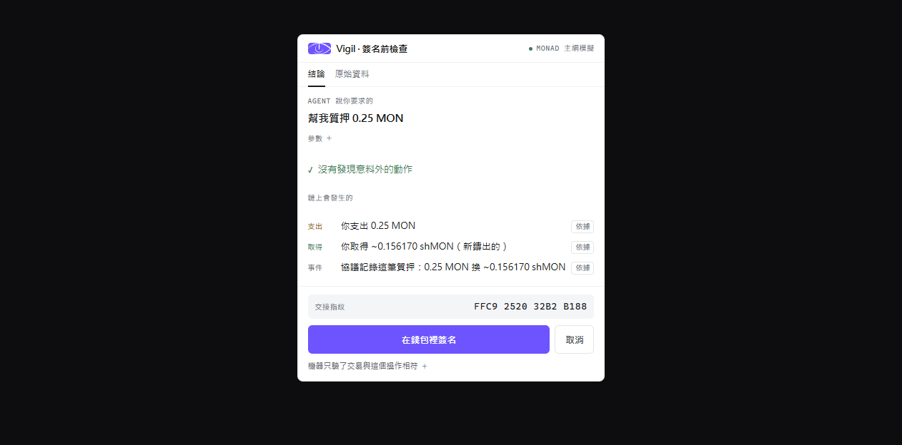
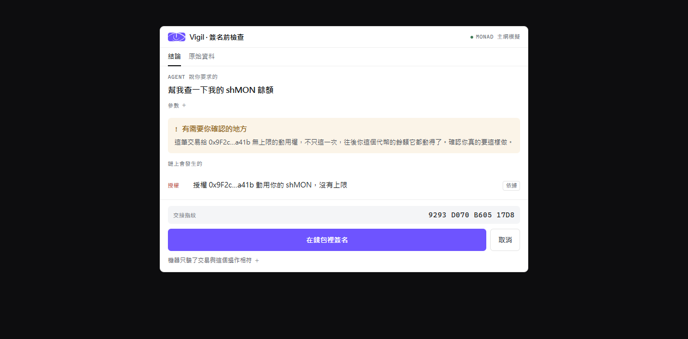

# Vigil

[](https://github.com/USDHGwang/Vigil/actions/workflows/ci.yml)
[](LICENSE)
[](https://www.monad.xyz/)
[](https://modelcontextprotocol.io/)

[English](README.md) | **简体中文** | [繁體中文](README.zh-TW.md)

[**安装**](app/MCP-SETUP.zh-CN.md) · [**线上站**](https://vigil-mcp.vercel.app)

> 拉丁文 *vigil*：守夜人。看见、回报，不替你决定。

AI agent 帮你在 Monad 上执行链上操作。**签名之前，在同一个对话里看到这笔交易实际会做什么。**

证据由 Monad 节点模拟执行产生，构造那笔交易的 agent 碰不到它的内容。

## 长这样

一笔正常的质押，对 Monad 主网真实模拟。这是 MCP Apps 面板在对话里的样子：



同样一句话，但 agent 被注入了指令——用户说查余额，agent 构造了一笔无上限授权。面板两边都不藏：



**不需要任何 LLM 判断。** 意图锚在用户的话，效果来自节点，对不上就会被看见。

支持 MCP Apps 的 host（Claude Desktop、claude.ai）渲染成图形面板；CLI agent
（Claude Code、Codex）拿到的就是上面这份文字。**两者内容一致，不是降级版。**

---

## 问题

用户叫 agent 帮他在链上做事。从他讲完话到一笔交易出现，中间发生什么他看不到。他能拿到的唯一线索是 agent 自己的转述，而 agent 就是构造那笔交易的一方。

构造方的 bug、被注入的指令、或单纯的误解，会原样进入那句转述，读起来毫无异状。用户手上只有一个动作：签，或不签。签了不可逆。

两个佐证：

- 2025-02 Bybit 损失约 15 亿美元。攻击者篡改 Safe 钱包的网页前端，签名者画面上是正常转账，实际签出的交易改掉了钱包控制权（[NCC Group](https://www.nccgroup.com/research/in-depth-technical-analysis-of-the-bybit-hack/)、[BlockSec](https://blocksecteam.medium.com/bybit-1-5b-hack-in-depth-analysis-of-the-malicious-safe-wallet-upgrade-attack-2b82e37d4d28)）。签名的是专业人员。
- [Scam Sniffer 2024 年报](https://drops.scamsniffer.io/scam-sniffer-2024-web3-phishing-attacks-wallet-drainers-drain-494-million/)：wallet drainer 一年卷走约 4.94 亿美元，33.2 万个地址受害。

自己开 dapp 网页手动操作的人不在此列。dapp 前端会显示预期结果，那个情境不需要这个工具。

## 为什么钱包补不了

钱包在 `eth_sendTransaction` 只拿得到 `to / from / value / data / gas`。用户说了什么、agent 打算做什么，钱包看不到。

2026-07 查证七家钱包（MetaMask、Rabby、Phantom、Coinbase、Trust、OKX、Backpack），全部是「模拟 calldata 的资产变动 + 比对风险数据库」，没有一家做「用户要什么」对「交易做什么」的比对。不是不想做，是结构上没有那个输入。

ERC-7730 的 clear signing 解的是「看不看得懂」，它的 intent 是静态的 per-function 描述，由构建方标注，不是这个人这一次要什么。

## 现有玩家停在哪

| | 静态规则 | 恶意模式库 | 用户当下的意图 |
|---|---|---|---|
| **签名前** | Fireblocks、Turnkey、Privy、Dfns、BitGo、MoonPay PayBox、Crossmint | MetaMask+Blockaid、Phantom+Blowfish、Coinbase、Trust、Rabby、Hexagate、MetaMask Agent Wallet | **空的** |
| **执行后** | — | — | Cobo Argus `postExecCheck`、MetaMask Advanced Permissions |

零件都存在，没有人在签名前这一格组起来。

**而这一格正在变得更重要。** MetaMask Advanced Permissions（ERC-7715）已经在 Monad
主网[上线](https://docs.metamask.io/smart-accounts-kit/get-started/supported-networks/)：用户授权一次之后，agent 执行时**不再有钱包弹窗**。
弹窗一消失，人就再也看不到每一笔在做什么。那个洞正是这个面板站的位置。

## 做法


⑤ 是人的工作不是机器的。**④ 比的是「交易」对「agent 调用的操作」，不是对「用户说的那句话」。**
这是两个不同的宣称，只有前者机器验得了，见下面的[两层比对](#两层比对)。

支持 MCP Apps 的 host 把 ⑤ 渲染成面板；CLI agent 拿到内容等价的文字面板。

④ 里面的 `verifyReceiptCoverage` 是完整性检查，不是意图比对：它验报告与原始变动一一对应，
数量相等且逐笔做对象身分比对，防漏、防重复、防捏造。意图比对是下面那六条规则。

### 两层比对

| 层 | 谁做 | 抓什么 |
|---|---|---|
| 结构 | 机器，确定性 | 模拟效果 vs agent 实际调用的 capability 与参数 |
| 语义 | 人 | agent 宣称用户要求的那句话 vs 实际效果 |

语义层不交给 LLM 判断。那个 LLM 读同一批内容，一样可被注入，信任会绕回原点。改成把两者并排给人看。

结构层有六条规则，**都不需要 per-protocol 知识**：

1. 出现这个操作没指定的授权对象（ERC-20 额度、ERC-721 单颗授权、NFT 整批授权都算）
2. receipt 的 operation 对不上调用的 method
3. 任何 `setApprovalForAll`（整个系列的转移权，含你以后才拿到的）
4. 任何无上限 ERC-20 授权
5. 任何给发送者以外对象的授权，不论额度大小
6. 没有解读模块就诚实说比不了，不猜

第 5 条存在，是因为第 1 条做不到的那一半。「这个操作没指定的对象」是拿 agent 传来的参数判断的，
而 agent 正是我们假设不可信的那一方。被注入的 agent 只要把攻击者填进 `spender`、额度压在无上限
门槛以下，第 1 条与第 4 条都不触发——第 5 条之前，那种情况会拿到绿勾。现在把余额交给别人一律
至少是「要你看一眼」。它不挡签名，授权给自己也照样算干净。

### 签名怎么交回你的钱包

面板跑在 MCP App 的 sandbox iframe 里，**碰不到 `window.ethereum`**。所以签名开一个独立页面，由用户自己的钱包完成。

三个设计决定：

- **交易由面板直接交出去，不绕回 agent。** agent 是我们假设不可信的那一方，让它在人核准之后再碰一次交易，前面的验证就白做了。
- **交易放在网址的 `#` 后面。** fragment 不会被浏览器放进 HTTP 请求，所以就算部署到云端，交易内容也不会送到那台服务器。
- **交接指纹。** 面板显示一串 16 个字，签名页显示它「实际收到的东西」算出来的那串——涵盖 chain id 与每笔交易的 `from`、`to`、`value`、`data`。**这是 hash 不是 MAC**：面板与签名页之间没有共享秘密，所以「换了交易、连指纹一起重算」的攻击者，解码时的自洽检查一定会放行。抓它的是人工比对——签名页那串跟面板已经显示的那串不会一样，而面板那串攻击者改不到。解码器挡得住的是「指纹跟内容对不上」与「链不是 Monad 主网」这两种。

签名页还会比对钱包当下的账户——不是这笔交易的发起人就不让签。

### 签名页不预设你是从哪里来的

这一页托管在固定网址、只读 fragment，所以任何人都做得出一个指向它的链接。上面那套指纹比对，
对「从来没看过面板」的用户没有用——写那串链接的人也写了那串指纹。也因为这样，它只留一个
托管位置（worker 的 `/sign`）：多一份就多一个要维持这些性质的地方，而各份的更新路径不一样。

所以这一页自己解一件事出来。它用 viem 在本机解 calldata（`approve`、`setApprovalForAll`、
`increaseAllowance`、ERC-2612 `permit`、Permit2、`transferFrom`），把那段字节做什么印在交易明细
上面，不依赖网址里的那句说明。认不得的 selector 明讲认不得，因为沉默会被读成「没问题」。
这一页也不挂「主网模拟」徽章——面板挂得起是因为它渲染的是 `debug_traceCall` 的结果，这一页
什么都没模拟。解出授权时也不会自动叫钱包，避免点一个链接就直接跳出签名框。

## 两个讲清楚的边界

**这个产品验一致性，不验安全性。** agent 诚实宣告一件有害的事并如实执行，我们会正确回报一致。

**stated intent 与 account 都是 agent 传来的未经验证输入。** 界面标签写「agent 说你要求的」，不写「你要求的」；账户那行明讲「这个地址是 agent 给的，我们没验过」。

**我们只看得到交易，而且只透过事件看。** 两个限制从这里来，都不是打算在这个形状里修的 bug：

- *签名钓鱼不在射程内。* `permit`、Permit2 的 `PermitSingle`、Seaport 订单——用户用
  `eth_signTypedData_v4` 签的是 typed data，根本没有交易产生，这条管线收不到也模拟不了。
  上面引的 Scam Sniffer 数字涵盖各种 drainer 包含这一类，我们不宣称处理得了那整个数字。
- *不发事件的授权看不见。* Moss 把模拟结果报成事件与原生转账，没有 storage diff。合约不发
  `Approval` 就写额度，结构上规则侦测不到；Permit2 的链上授权事件签名跟 ERC-20 不同，事件扫描
  也对不上。签名页那层会解 calldata 里的 Permit2 `approve`，涵盖直接调用，不涵盖包在别的合约里的。

## 现在做到哪

| 项目 | 状态 |
|---|---|
| 数据契约、情境 fixtures、面板渲染（纯函数）、人话转换层 | 完成 |
| 真实模拟管线（对主网 debug_traceCall）、六条结构规则、真实余额检查 | 完成 |
| MCP server + UI resource：MCP Apps 面板（Claude Desktop、claude.ai）+ CLI host 的 ANSI 文字 | 完成 |
| 签名交回钱包——两页同一串指纹、篡改路径浏览器实测、2026-08-07 主网端到端实送 | 完成 |
| 钱包连接（让 account 不再由 agent 提供） | 未开始 |
| 部署——MCP server 在 [vigil-mcp.usdhgwang.workers.dev](https://vigil-mcp.usdhgwang.workers.dev/health)、签名页只在那个 worker 的 `/sign`、介绍站 [GitHub Pages](https://vigil-mcp.vercel.app) | 完成 |

`pnpm check`：**364 tests**。`MOSS_SKIP_E2E=1` 之下 338 条完全不连外，其余对 Monad 主网跑模拟（不签名、不花钱）。

### 自己验过的（非文件转述）

`rpc.monad.xyz` 实跑：`debug_traceCall` 可用、chain ID 143、CORS 对任意 origin 开放。trace 同时证实 shMONAD proxy 指向的 implementation 与代码内常数一致。

Monad 主网支持 EIP-7702：带 authorization 的交易 gas 比对照组多 25,382，符合规范每个授权 25,000。

## 跑起来

```bash
cd app
pnpm install          # 会自动建 vendor 里的 Moss，不需要外部 checkout
pnpm check            # typecheck + 364 tests（MOSS_SKIP_E2E=1 只跑离线的 338 条）
pnpm demo             # 终端直接看面板，不需要任何 host
pnpm demo injection   # 看被注入指令的那一幕
pnpm build:all        # 面板、签名页、预览页、MCP server
```

**默认模拟账户主网上只有 0.001 MON**，付不起任何一笔交易，所以质押情境会显示「余额不够、不能签」。**那是真话不是坏掉**——我们会拿真实余额对，不吃模拟时被盖上去的数字。要看通过的样子：`DEMO_ACCOUNT=0x… pnpm demo`。

接进 Claude Desktop 的步骤见 [app/MCP-SETUP.zh-CN.md](app/MCP-SETUP.zh-CN.md)。

## 底层

[Moss](https://github.com/nishuzumi/moss)：Monad 上的链上操作与模拟框架，MIT。作者是
Monad Foundation 的 DevRel 工程师，但项目挂在个人账号下，README 自标
`unaudited alpha software`。

源码收在 [`app/vendor/moss/`](app/vendor/moss/README.md)，钉在上游 `97df9c1`。
收进来的理由、改了哪两个字段、怎么更新，都写在那份 README 里。

本项目作者写的 shMONAD protocol adapter 已开 PR 进 Moss upstream（[#128](https://github.com/nishuzumi/moss/pull/128)）。

我们对 Moss 的依赖分三件事，规则涵盖的程度不一样：

| Moss 负责什么 | 它错了会怎样 | 我们看得出来吗 |
|---|---|---|
| 从 capability 组出交易 | 被模拟的是错的 calldata | 看得出来——面板显示的是「实际组出来那笔」的效果，而交给钱包签的就是被模拟的那一笔 |
| 从 trace 产出原始 changes | 后面全部都错 | **看不出来。这是整个设计的地板** |
| adapter 把 changes 读成 receipt | 写出来的摘要是错的 | 部分——结构规则读的是原始 changes 不是 adapter 的解读，所以 adapter 错不会让一笔多出来的授权变成干净面板 |

中间那列是诚实的极限：证据的质量上限就是模拟器的质量，这个项目没有重新推导它。

## 文件

| 文件 | 内容 |
|---|---|
| [app/MCP-SETUP.zh-CN.md](app/MCP-SETUP.zh-CN.md) | 安装与接线（也有 [English](app/MCP-SETUP.md)、[繁體中文](app/MCP-SETUP.zh-TW.md)） |

## 授权

[MIT](LICENSE)。

---

Monad Builder Camp Hackathon 2026
